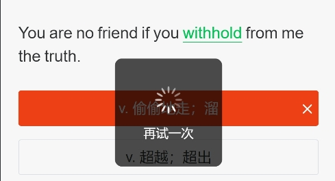
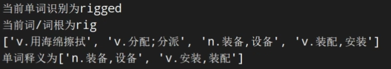

# 基于 python 的词达人答题脚本

openCV 图像+pytesseract 文本识别+pyautogui 实现自动操作+numpy 数值计算

## 前言

我目前正在读大一,有一门课程的作业一直深深困扰着我,也就是词达人的作业.每次都有海量的单词的冗余的题目,不仅对于词汇的提高非常有限,反而增加了负担。而这样大量的重复工作正是每一个程序员所深恶痛绝的，因此在课程期间，我自学了
python 及其部分应用，在课余时间，我利用 python 编写了一个基于 openCV 图像+pytesseract 文本识别+pyautogui
实现自动操作+numpy 数值计算的词达人自动答题脚本。该脚本可以自动识别题目，自动选择答案，并自动提交答案，正确率可以稳定在
85%以上，大幅度实现了降本增效，这也正是编程的目的与乐趣所在。

## 以下是程序设计报告内容

**目录**

词达人答题脚本

第 一 章 绪论

1.1 开发环境

第二章 功能实现

2.1.1 答题模式

2.1.2 思路

第三章 详细设计

3.1 总体结构及功能模块划分

3.2 获取词典界面的单词和释义

3.3 获取题目和选项的文本内容

3.4 对比分析，获取最可能的选项列表

3.5 自动操作，流程处理

第四章 详细设计

第五章 主要功能模块代码

第六章 课程设计心得

## **_第 一 章_** **_绪论_**

### **1.1** **_开发环境_**

**_开发工具_**: PyCharm2023。PyCharm 是由 JetBrains 公司开发的一款 Python 集成开发环境（IDE），被广泛认可为最优秀的 Python
开发工具之一。PyCharm 提供了丰富而强大的功能，包括智能代码提示、代码自动补全、代码重构、Python web 开发、版本控制工具集成（如
Git、SVN 等）、单元测试、代码分析以及创新的 GUI 设计支持等。本实验使用 Python3.8 开发 。

**_开发语言_**: Python。Python 是一种高级面向对象的编程语言，它继承了多种语言的优点，并摒弃了其他语言中的复杂性，使得 Python
具有强大而简单易用的特点。Python 在设计之初就注重简洁、易读和可维护性，因此被称为一种“优雅的”编程语言。

**_所用库_**:openCV, pytesseract, pyautogui,
numpy。OpenCV 主要用于对图片进行处理从而提高识别效率，使用 pytesseract 识别文本。pyautogui 可以通过 python
程序模拟人鼠标点击操作实现自动化，numpy 则用于数值高效计算，实现算法，提高自动化效率。

## **_第二章_** **思路及分析**

#### 2.1.1 答题模式

词达人的答题模式为：

（1）一次作业为一个小测试，一共有三十个词语，通过自由选择一定数量的词语进入练习。

（2）练习开头会用词典的形式展现单词的释义、词义。

（3）展示完所有选择的单词的词典界面之后，会给出与所选词数大致相等的练习题，形式为给出一段距离，其中关键词语用绿色标出，有四个选项对应该词语的释义，有两次机会做答，选择错误则进入下一题，答完题目即为完成。

（4）当所有词语都被选择完并作答后，该测试即为完成。

#### 2.1.2 思路

（1） 识别文本，建立词典。由于答题界面的区域可通过 windows 的分屏功能和系统分辨率确定，固可以通过 openCV
识别功能记录单词和单词释义，创建一个临时词典。

（2） 提取题干，对比分析。通过 openCV 获取题干中的绿色单词和选项文本，通过对比分析和匹配算法，获取最可能的选项列表。

（3） 自动操作，流程处理。通过 pyautogui 实现自动操作，并按照一定的逻辑处理流程。

## **第三章** **详细设计**

### **3.1** **_总体结构及功能模块划分_**

运行时通过实例化 word 类，通过函数调用创建一个字典，并通过 answer 类中的逻辑处理执行答题。

可分为 Word 类，Answer 类，和 Const 类，Word 类用于识别文本创建词典，其中包含读取文本内容的静态函数

Word 类


Answer 类


其中，const 类中存放的主要为一些常量和读取常量的函数，此处就不展示了。

下面进行详细流程设计和算法设计

### **3.2** **_获取词典界面的单词和释义_**

通过记录数据，得到单词所在区域和释义所在区域，首先初始化一个 word 类，其含有一个空字典，用于生成词典。

对于获取英文单词，使用 openCV 进行预处理和使用特殊的 config 使得图像内容更加突出，提高准确率。函数如下

```python
def get_word_in_dic(word_image_path: str) -> str:
    img = cv2.imread(word_image_path)
    gray_img = cv2.cvtColor(img, cv2.COLOR_BGR2GRAY)  # 将图像从彩色转换为灰度图像
    word = pytesseract.image_to_string(gray_img, lang="eng", config=ENGLISH_CONFIG)
    return word.replace("\n", "")
```

其中

```
ENGLISH_CONFIG =r'--oem 3 --psm 6 -c tessedit_char_whitelist=abcdefghijklmnopqrstuvwxyz.'# 配置大模型参数，并且设置识别白名单，用于提高英文识别准确率
```

"--psm 6"的意义是按行识别,
"tessedit_char_whitelist"的意义是设置识别白名单，只识别白名单中的字符，可以提高识别准确率,
"--oem 3"的意义是使用 Tesseract 的默认模型，可以提高识别准确率。
对于获取中文内容，同样使用预处理方式，使识别准确率提高

```python
def get_translation_in_dic(translation_image_path: str) -> list:
    """
    获取中文字段,同时可用于读取前30个词的翻译,和题干中的选项中文
    :param translation_image_path:
    :return:
    """
    image = Image.open(translation_image_path)
    image = image.convert('L')  # 转换为灰度图
    enhancer = ImageEnhance.Contrast(image)
    image = enhancer.enhance(2)  # 提高对比度
    image = image.filter(ImageFilter.MedianFilter())  # 应用中值滤波去噪
    image = image.point(lambda x: 0 if x < 140 else 255)
    result = pytesseract.image_to_string(
        image, lang="chi_sim", config=r"--oem 3 --psm 6"
    ).splitlines()
    # 去除可能的空行,同时去除可能出现的多识别的非中文字符
    result = [
        line.replace(" ", "")
        for line in result
        if (line != "" and (line.isalnum() == False))
    ]
    print(result)
    return result
```

经过测试，识别中文比识别英文需要的预处理更加复杂，需要通过灰度图转换，对比度增强，中值滤波，二值化等操作，并且使用机器学习模型才能得到较好地识别效果。
通过以上两个函数，就可以通过对固定区域的截图，将图片路径作为参数传递，可以得到单词和对应中文释义，并点击继续按钮，从而创建词典。

### **3.3** **_获取题目界面的单词和选项_**

由于题目界面与词典界面不同，题干中句子的关键词由绿色标记，其余的单词为黑色，所以为了识别出绿色的单词，需要对图片进行色彩转换，规定一个绿色的范围，后通过掩码标记，将不属于这个范围的像素点全部转化为白色，从而得到绿色单词。

```python
def get_word_in_question(question_image_path: str) -> str:
    """
    获取题干中标记为绿色的单词,先使用掩码将非绿色部分标记为白色,之后读取转化后的图片获取单词
    :param question_image_path: 题干的图片路径
    :return:
    """
    image = Image.open(question_image_path)
    image_cv = cv2.cvtColor(npy.array(image), cv2.COLOR_RGB2BGR)

    # 定义绿色的 HSV 范围
    lower_green = npy.array([60, 60, 60])
    upper_green = npy.array([90, 255, 255])

    # 将图片转换为 HSV 格式，并根据绿色范围创建掩码,把绿色部分标记为黑色,其余部分为白色
    hsv = cv2.cvtColor(image_cv, cv2.COLOR_BGR2HSV)
    mask = cv2.inRange(hsv, lower_green, upper_green)
    result = cv2.bitwise_and(image_cv, image_cv, mask=mask)
    result[mask == 0] = [255, 255, 255]

    text = pytesseract.image_to_string(result, lang="eng", config=ENGLISH_CONFIG)
    return text.strip().lower().replace(" ", "")
```

效果如下：


便可以得到题干中的单词 arrogant

对于选项中的中文内容，这里有一个麻烦需要处理，由于不同的题干长度会导致题干占用的行数不同，从而使得选项所在区域是在变化的，解决办法就是先调用一个
getLine 函数，获取当前界面的总行数。由于选项的行数确定为 4 行，而且形状确定，所以可以由 getLines 返回的行数确定截取范围。这里使用的
python 的使用类名创建类的方法：

```python
line_name = eval("Line" + str(self.get_lines()))
line = line_name()
```

line_name()
定义在 const 文件中，每一个 line
对应的类中含有数据读取函数和对应的数据，记录了选项所在区域和鼠标点击的坐标数据。至此，准备工作已经基本完成，现在已经获取了所选词语的字典，并且能够准确识别题干的关键词和选项的内容，接下来就是答题的逻辑了。

#### **3.4 获取最佳选项**

对于获取最佳选项的函数：

```python
def get_options(translations: list, options: list) -> list:
    """
    获取当前单词对应的可能选项
    :param translations:某一单词的字典翻译list
    :param options: 当前选项的list
    :return: 一个存有2个选项代号的list,记录了当前题目最可能的答案选项
    """
```

我们希望返回一个列表，其中从索引 0 到 1 记录了最可能的两个选项（当然，这两个选项一定是不一样的），这里的“最可能”模仿的是人做题时的思考逻辑，即先思考关键词有哪些释义，然后观察选项思考最接近的意思。
这时，当单词仅仅有两个释义时，我们就可以直接返回这两个释义对应的最相似的选项；但是当单词有多个释义的时候，如果我们发现某一个释义在选项中找不到比较接近的（即释义和选项之间的最高匹配度较低），那就说明答案一定不会和这个释义对应。那么我们就可以依据释义与选项之间的最高匹配度进行排序，从而得到最可能在选项出现答案中的两个释义，并获取其对应的选项返回。
因此我们可以设计一个算法，通过多次排序和比较，返回一个 2 元列表，列表中记录了最可能的选项。

具体的算法设计如下：

```python
def get_options(translations: list, options: list) -> list:
    """
    获取当前单词对应的可能选项
    :param translations:某一单词的字典翻译list
    :param options: 当前选项的list
    :return: 一个存有4个选项代号的list,记录了当前单词最可能的选项list
    """
    print("单词释义为" + str(translations))
    options_dict = {}
    for j in range(4):
        # 每个选项内容对应一个按钮编号1-4
        options_dict[options[j]] = j
    options_result = []
    # 只会有两次点击机会
    max_sim_of_translation = {}
    for t in range(len(translations)):
        sim = {}
        for option in options:
            sim[option] = Answer.get_similarity(translations[t], option)  # 对于每一个释义，获取每一个选项与其的相似度
        sim = sorted(sim.items(), key=lambda item: item[1], reverse=True)  # 从高到低排序
        max_sim_of_translation[translations[t]] = sim[0]  # 记录当前释义的最大相似度 其值为一个元组（选项，相似度）
    max_sim_of_translation = sorted(max_sim_of_translation.items(), key=lambda item: item[1][1], reverse=True)
    options_result.append(options_dict[max_sim_of_translation[0][1][0]])
    options_result.append(options_dict[max_sim_of_translation[1][1][0]])
    print(options_result)
    return options_result
```

因此，还需要设计一个返回字符串匹配度的函数，这里分为中文和英文判别。
对于中文判断，使用 jacquard 算法,用于获取正确选项：

```python
def get_similarity(str1: str, str2: str) -> float:
    """
    获取两组字符的相似度,使用jacquard算法,用于获取正确选项
    :return: 相似值,∈[0,1],越高说明越相似
    """
    set1 = set(str1)
    set2 = set(str2)
    intersection = len(set1.intersection(set2))
    union = len(set1.union(set2))
    return intersection / union
```

对于英文单词则相对复杂，由于英文单词在词典中以原型储存，而在句子中会出现各种时态，因此需要先将句子中的单词与词典中的词一一匹配字符串，这里需要考虑到字符顺序，返回两组字符串按照同一顺序的最大相同字符占比。
算法设计如下：

```python
def get_origin_word(word_get: str, word_dic: dict) -> str:
    """
    获取当前单词的词根
    :param word_dic: 词典
    :param word_get: 当前题中的单词
    :return: 当前单词的词根
    """
    word_res = word_get
    word_len = len(word_get)
    max_similarity = 0
    for word in word_dic.keys():
        max_len = max(len(word), word_len)
        min_len = min(len(word), word_len)
        same = 0
        for i in range(min_len):
            if word_get[i] == word[i]:
                same += 1
        if (similarity := same / max_len) > max_similarity:
            max_similarity = similarity
            word_res = word
    return word_res
```

通过接收识别出的单词和词典作为参数，返回单词的词根。

经过测试，这种算法能够比较准确地找到答案，并且能够保证在出现多个释义时，能够找到最接近的选项，准确率很高。

#### **3.5 答题流程和异常处理**

对于答题的流程，在 answer 类中设计了一个 routine 函数用于处理流程，抛出异常。对于答案错误的判断如下

第一次若答错，会出现以下界面


所以，可以通过在一定时间差后获取点击的选项所在坐标的 RGB 值，通过判断其是否为红色。若为红色，则选择 option_result 的第二个选项
若依然错误，则会跳出一个解释词义的选项，并且有多行文字，此时再次调用 get_line 函数，若行数过大，则说明两次答案都错了，此时自动点击下方的继续按钮，进入下一题。

判断颜色的函数代码如下，可通过获取 rgb 值判断

```python
def is_green(rgb: tuple) -> bool:
    """
    两次都做错,会进入释义界面,在固定位置会有一个绿点,以此判断
    判断给定的 RGB 值是否属于绿色。
    """
    r, g, b = rgb
    return g > r and g > b
```

至此，已经可以基本完成答题流程，实现较高的正确率。

## **_第四章_** **运行结果**

任意选取一次作业，进入界面选择 10 个单次后开始答题，此时需要输入单词个数 10

读取单词生成词典时候控制台输出如下图：


可见，程序正确读取了单词，第一行是读取的单词释义，同时在第二行输出当前的词典全部内容便于调试。程序成功生成了词典，释义以列表形式储存便于读取释义。

然后进入答题界面效果如下


此时，控制台会输出识别出来的的单词和最终的单词，中间便用到了我们写的还原词根的算法。比如：


可以发现，在遇到变形如 rigged 时，程序可以正确还原为原型，同时当识别错误时如 disciose 错识别为 aisciose 时候，可以纠正为正确的单词。

最后，程序会自动选择答案，并输出选择的答案，同时输出正确率。


经过多次测试，发现单词数量在 15-20 的时候效果最好，保证了正确率稳定在 90%以上。并且效率较高。运行的视频在附件中。

至此，程序已经成功运行，并且能够实现识别-分析-答题一体，正确率较高，实现了自动答题的功能。

## **_第五章_** **收获与总结**

通过这次实验，我对 python 的强大功能有了进一步的了解，并且初始了一些计算机图形领域的一些应用和处理，提高了对 python 的理解和对编程的实际运用能力。
